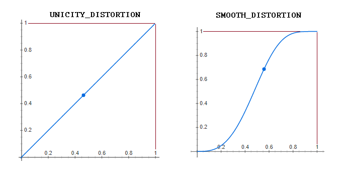

# Yuki::Animation

`Yuki::Animation` is the module defining all the animation kind of the modern PSDK animations. The modern PSDK animations differ from other kind of animation in the way that it's not necessarely frame based. By default it uses IRL time, but if you're not happy with time, you can define another time source. All timed animations has a duration that describe how much time they will perform from the time they begin.

The biggest strenght of the modern animations is that you can combine them in two ways :
- In sequence (`animation1.play_before(animation2)`)
- In parallel (`animation1.parallel_play(animation1_1)`)

This allows you to make complex animations from several simple animations.

In addition of all of this, you can also distord time inside a single animation. By default time in animations is rectilinear : from 0 (begining) to 1 (end). You can specify a time distortion to change how the animation goes from begin to end and create a new kind of movement.

## How does it work internally ?

In PSDK, animations are considered as animation if they meet the following criteria:
- There's a `update` method
- There's a `done?` property

### Methods and attributes
The modern PSDK animations are a bit more complex since they can be combined. All the modern animation should inherit from `Yuki::Animation::TimedAnimation`. This class provide the following public methods/attributes:

- `parallel_animations` Get the list of animations that plays in parallel.
- `sub_animation` Get the animation that is played after the animation is done and its parallel animations are done.
- `root` Get the root animation (the animation which you should call update and done? to update it and know if it's done).
- `start(begin_offset = 0)` Start the animation with an optional offset in time (calls internally the `start` with the right offset of all sub animations & parallel animations).
- `done?` Tells if the animation, its parallel animations & its sub animations have finished to play.
- `update` Update the parallel animations, the animation and if those are done, the sub animation.
- `parallel_add(animation)` Add an animation in parallel of the current one, returns the current one.
- `animation1 << animation2` Plays `animation2` in parallel of `animation1` returns `animation1`.
- `animation1 | animation2` Plays `animation2` in parallel of `animation1` returns `animation1`.
- `in_parallel_of(animation)` Plays the current animation in parallel of `animation`, returns `animation`
- `animation2 >> animation1` Plays `animation2` in parallel of `animation1` returns `animation1`.
- `play_before(animation)` Plays the current animation before `animation` and returns `animation`.
- `animation1 > animation2` Plays `animation1` before `animation2` and returns `animation2`.
- `resolver=(resolver)` Specify a resolver (accepting #call(key)) that is used to resolve objects in animation if they're named with symbols.

This class also define private methods that helps to perform the `update`, `done?` and `start` method properly:
- `private_done?` Tells if the current animation (itself) is done.
- `private_began?` Tells if the current animation (itself) has begun (current_time >= begin_time).
- `update_internal(time_factor)` Perform the internal update describing what the animation should do, `time_factor` is a number between 0 & 1. `update_internal(distored 1)` should be called when the animation is done itself. (To ensure ending position.)
- `resolve(param)` If param is not a Symbol, returns param, otherwise calls the resolver with param as parameter to get the actual object.

### The start method

The start method should be called right before you start the animation, the responsibility of this function is to fetch all the parameters using the resolver when needed and calling the start method of subsequent & parallel animations. (This way you only need to write `parent.start` and all the other animations will start as well but at the right time).

What happens internally is that all parallel animations are started with the same `begin_offset` parameter while the sub animation is called with `begin_offset + time_to_process`.

### The update method

This method is responsible of updating the animation itself and all the parallel/sub animations.

Before updating everything this method check if the animation even started. If the animation is done and wasn't set to final position it will set the animation to final position.

There's a specific order for the update:
1. All the parallel are updated
2. The animation is set to end position if it's done
3. The sub animation is updated if the parallel animations are done and the current animation is done.
4. The current animation is set the right position if it's not done.

As all combined animations are updated you only need to call the update method of the parent animation. Same goes for checking if the combination of animation is done, you just need to call the `done?` method of the parent animation. Example:

```ruby
until parent.done?
  parent.update
  Graphics.update
end
```

The update method calls the `update_internal(time_factor)` method of the current animation with a number that should be between 0 & 1 (unless the distortion tells otherwise). This number correspond to the progression between begin_time (0) and end_time (1). The end time is begin_time (when start was called + begin_offset) + time_to_process.

### Initializing an animation

When you create an animation object, it should always take `time_to_process` as first parameter. Other parameters are kind specific. Child classes of `TimedAnimation` usually define the `distortion` and `time_source` parameter as keyword argument while `TimedAnimation` take them as last parameters.

Normally you should never instanciate a `TimedAnimation` animation unless you want to perform a wait section in your animation. In this case, we suggest you use `Yuki::Animation.wait(time)` instead, it returns a `TimedAnimation` object.

## All kind of animations

In order to perform specific kind of animation, we defined subclasses of `TimedAnimation` that does the desired job. This section will list them all.

### ScalarAnimation

This kind of animation is dedicated to perform scalar movement, meaning we update only 1 component of an element at once. This can be x, y, ox, oy, angle, opacity etc...

Here's the ways to create ScalarAnimations :
```ruby
# The parameter list
Yuki::Animation::ScalarAnimation.new(during, on, property, a, b, distortion: :UNICITY_DISTORTION, time_source: :GENERIC_TIME_SOURCE)
# Example :
# Fade a sprite out for 0.5s
fade_animation = Yuki::Animation::ScalarAnimation.new(0.5, sprite, :opacity=, 255, 0)

# Using Yuki::Animation methods
# Rotation
Yuki::Animation.rotation(during, on, angle_start, angle_end, distortion: :UNICITY_DISTORTION, time_source: :GENERIC_TIME_SOURCE)
# Example:
# Rotate a sprite from 0° to 90° in 250ms
rotation = Yuki::Animation.rotation(0.25, sprite, 0, 90)

# Opacity changes
Yuki::Animation.opacity_change(during, on, opacity_start, opacity_end, distortion: :UNICITY_DISTORTION, time_source: :GENERIC_TIME_SOURCE)
# Example:
# Fade a sprite in for 0.75s
fade_in = Yuki::Animation.opacity_change(0.75, sprite, 0, 255)
```

In the parameter `a` is the starting point and `b` is the ending point. The parameter `on` is the element that will see its `property` changed and `property` is the method of the element that is called.

### Dim2Animation & Dim2AnimationDiscreet

Those animations allows you to do animations on vector like elements. For example, move a sprite (x & y) or move its image origin (ox, oy). There's the non discreet version (`Dim2Animation`) which will throw floating point number in coordinates and the discreet one (`Dim2AnimationDiscreet`) that will always throw integer number in the position (usefull for SpriteStacks).

Here's ways to create Dim2Animation animations:
```ruby
# The parameter list
Yuki::Animation::Dim2Animation.new(during, on, property, a_x, a_y, b_x, b_y, distortion: :UNICITY_DISTORTION, time_source: :GENERIC_TIME_SOURCE)
# Example:
# Move a sprite from (0, 5) to (100, 32) in 3s
movement = Yuki::Animation::Dim2Animation.new(3, sprite, :set_position, 0, 100, 5, 32)
# Move a spritestack from(-320, 0) to (0, 0) in 1s
st_movement = Yuki::Animation::Dim2Animation.new(1, stack, :set_position, -320, 0, 0, 0)

# Using Yuki::Animation methods
# Movement
Yuki::Animation.move(during, on, start_x, start_y, end_x, end_y, distortion: :UNICITY_DISTORTION, time_source: :GENERIC_TIME_SOURCE)
# Example move a sprite from (0, 5) to (100, 32) in 3s
movement = Yuki::Animation.move(3, sprite, 0, 100, 5, 32)

# Discreet movement
Yuki::Animation.move_discreet(during, on, start_x, start_y, end_x, end_y, distortion: :UNICITY_DISTORTION, time_source: :GENERIC_TIME_SOURCE)
# Example move a spritestack from(-320, 0) to (0, 0) in 1s
st_movement = Yuki::Animation.move_discreet(1, stack, -320, 0, 0, 0)

# Shift of the image origin
Yuki::Animation.shift(during, on, start_x, start_y, end_x, end_y, distortion: :UNICITY_DISTORTION, time_source: :GENERIC_TIME_SOURCE)
# Example shift an image from its center to top left corner during 2s
shift = Yuki::Animation.shift(2, sprite, sprite.width / 2, sprite.height / 2, 0, 0)
```

### DiscreetAnimation

Sometimes you need to do discreet changes like changing the cell displayed inside a src_rect of a sprite. With the DiscreetAnimation you can do this. You can specify integer values that tells you from which point to which point you go and an additional factor to multiply those integer and ensure you don't have weird thing like the image swipping inside the sprite.

Here's ways to create DiscreetAnimation animations:
```ruby
# The parameter list
Yuki::Animation::DiscreetAnimation.new(during, on, property, a, b, factor = 1, distortion: :UNICITY_DISTORTION, time_source: :GENERIC_TIME_SOURCE)
# Example perform a change of src_rect.x from 0 to 64 with steps of 32 during 5s
anim = Yuki::Animation::DiscreetAnimation.new(5, sprite.src_rect, :x=, 0, 2, 32)

# Using Yuki::Animation methods
# Changing the x coordinate of a src_rect
Yuki::Animation.cell_x_change(during, on, cell_start, cell_end, width, distortion: :UNICITY_DISTORTION, time_source: :GENERIC_TIME_SOURCE)
# Example, showing cell 0, 1 & 2 with cell of width = 32 during 5s
anim = Yuki::Animation.cell_x_change(5, sprite.src_rect, 0, 2, 32)

# Changing the y coordinate of a src_rect
Yuki::Animation.cell_y_change(during, on, cell_start, cell_end, height, distortion: :UNICITY_DISTORTION, time_source: :GENERIC_TIME_SOURCE)
# Example, showing cell 0, 1 & 2 with cell of height = 32 during 5s
anim = Yuki::Animation.cell_y_change(5, sprite.src_rect, 0, 2, 32)
```

### Command

The `Command` animations are specific, they're not exactly `TimedAnimation` since they only use the composition. This kind of animation is usefull for specific stuff that needs to happen immedialtely after an animation complete or before another starts. For example `AudioCommand` allowing you to play sound during an animation is a child of `Command` kind animations.

The `update_internal` function of Commands takes no parameter and are called only once.

### AudioCommand

The `AudioCommand` allows you to play a sound from one of the specified audio folder depending on the method of audio you choose. It's better to use methods instead of writing everything yourself.

Here's the way to create `AudioCommand` animations:
```ruby
# Parameter list
Yuki::Animation::AudioCommand.new(type, [filename, [volume, [pitch]]])
# Example, playing a BGM (audio/bgm/cave.ogg) with default volume & pitch
bgm_play = Yuki::Animation::AudioCommand.new(:bgm_play, 'cave')

# Using Yuki::Animation methods
# Play a bgm:
Yuki::Animation.bgm_play(filename, volume = 100, pitch = 100)
# Example, play audio/bgm/cave.ogg with volume = 100 & pitch = 100
bgm_play = Yuki::Animation.bgm_play(cave)

# Stop the bgm
Yuki::Animation.bgm_stop

# Play a bgs
Yuki::Animation.bgs_play(filename, volume = 100, pitch = 100)

# Stop the bgs
Yuki::Animation.bgs_stop

# Play a ME
Yuki::Animation.me_play(filename, volume = 100, pitch = 100)

# Play a SE
Yuki::Animation.se_play(filename, volume = 100, pitch = 100)
```

Please note that this is not a dumbass system, creating the animation doesn't play the sound until it gets updated by the parent animation or until you purposedely call `update` fromt the `AudioCommand` you created.

### SpriteCreationCommand

This kind of animation is really tricky because it allows you to create sprites inside the animation. In order to be able to use this kind of animation, your resolver needs to be a method from `Hash` or at least have a receiver that repond to `[sym] = value` (the resolver needs to respond to `receiver`).

Here's the ways to create a `SpriteCreationCommand`:
```ruby
# Parameter list
Yuki::Animation::SpriteCreationCommand.new(viewport, name, type, args, *properties)

# Using Yuki::Animation method
Yuki::Animation.create_sprite(viewport, name, type, args = nil, *properties)
```

Explaination of the parameters:
- `viewport` viewport is the viewport used by the sprite to be show, it can be a symbol if you want to resolve it.
- `name` name is the name of the sprite in the resolver, it has to be a symbol!
- `type` is the class of the sprite you want to create, it can be `Sprite`, `SpriteSheet` or anything else
- `args` represent an array or nil, that's the parameters that are passed after `viewport` in the `type.new` call.
- `properties` represent a list of messages you'll send to the sprite to set it to an initial state.

Example:
```ruby
sheet = Yuki::Animation.create_sprite(viewport, :sheet, SpriteSheet, [4, 4], [:set_position, 0, 25], [:set_origin, 16, 32])
```

This command will create a SpriteSheet with 16 cells at the position (0, 25) with an origin of (16, 32) in the viewport when `update` will be called.

### ResolverObjectCommand

This kind of command allows you to send a command to any object when it's updated. It can be usefull to send messages to the scene during the animation process (it is used in the PC UI to show the new box at the middle of the animation).

Here's the ways to create ResolverObjectCommand:
```ruby
# Parameter list
Yuki::Animation::ResolverObjectCommand.new(name_or_object, method_name, *args)

# Using Yuki::Animation methods
# Send a message
Yuki::Animation.send_command_to(name_or_object, method_name, *args)

# Dispose a sprite
Yuki::Animation.dispose_sprite(name)
```

As all the other command, that gets executed only once and that's when the `update` method is called the first time (after parent animation).

### TimedCommands

This kind of animation is a `DiscreetAnimation` allowing you to execute a list of commands (see above) in a constant delta time (during the time frame you gave to the `TimedCommands` animation).

Here's how to create a `TimedCommands` animation:
```ruby
# Paramater list
Yuki::Animation::TimedCommands.new(during, *animation_commands)

# Using Yuki::Animation method
Yuki::Animation.run_commands_during(duration, *animation_commands)
```

Note that `animation_commands` has to be a list of `Command` object (audio, sprite, resolvercommand etc...). It will divide the duration in as much commands there's and play a new command each time a fraction of the duration elapse. The first command is played at 0 and the last command is played at 1. This means if you have 3 commands, the first will be played at 0, the second at 0.5 and the last at 1; If you have 4 commands, the first will be played at 0, the second at 0.33, the third at 0.66 and the last at 1.

Note that all the `SpriteCreationCommand` will be played at 0 regardless of their position in the list.


### TimedLoopAnimation

This animation is specific, it is always done **but** it plays the sub & parallel animation in loop. Each time the `time_to_process` duration is reach, the loop restart from 0 !

It's highly recommanded to put this kind of animation in parallel of a wait animation if you want to benefit from `done?` that can stop the animation. Otherwise in specific case like Pokémon Menu where all Pokémon are constantly animated, you can juste use this kind of animation alone and ignore the `done?` result :)

## How to combine animations

As explained above, the real power of modern animation is that you can combine them allowing you to make a really complex animation. In order to do so, you will need to use `play_before` and `parallel_add` in order to make animation combination.

Let's imagine you want a sprite to be 2 frame animated during the animation. You want this sprite to move from its origin position to (100, 150) while rotating on itself (assuming it's centered), once done, you want it to go back to its original position but with a smooth motion without rotation.

Here's the code you would get to do this:
```ruby
anim = Yuki::Animation # Lets use a local variable to make it shorter
# Root animation: moving from origin to (100, 150) with rotation
animation = anim.move(2, sprite, sprite.x, sprite.y, 100, 150)
animation.parallel_play(anime.rotation(2, sprite, 0, 720))

# Next animation going back with a smooth motion without rotation
animation.play_before(anim.move(2, sprite, 100, 150, sprite.x, sprite.y, distortion: :SMOOTH_DISTORTION))

# Creating the loop for the 2 frame change
cell_change = anim.cell_x_change(0.5, sprite.src_rect, 0, 1, sprite.width)
looper = anim::TimedLoopAnimation.new(0.5)
looper.play_before(cell_change)

# Add the 2frame loop in the global animation
animation.parallel_play(looper)

# Play the animation
animation.start
until animation.done?
  animation.update
  Graphics.update
end
```

In this example, the loop will play until the end because the root animation will be done when its sub animation will be done. If you want to prevent loopers from looping until the end of the animation, make them parallel animation of parallel wait animations ;)

Note that you're actually able to combine complex animation with other complex animation, they way the complex animation will play depends totally on how you combine them.

## How to save animations to the disk

At some point having all the animation in the code is unmanageable. Especially for the move animations because there's a lot. Thankfully the system was designed to allow loading animation from disk (as long as you saved them to the disk).

Here's the rule to be able to save animation to the disk:
1. All the object you manipulate in the animation shouldn't be passed directly and should rely on the resolver. Example: the sprites should be named instead of passed.
2. You should not assign the resolver before saving the animation.

If you respect those rules, you should be able to save & load your animation from disk.
This mean that you need to create resolver for animation you loaded from disk.

Let's take the example of the  `How to combine animations` section.

1. Create & save the animation to disk:
```ruby
anim = Yuki::Animation # Lets use a local variable to make it shorter
# Root animation: moving from origin to (100, 150) with rotation
animation = anim.move(2, :sprite, :sprite_x, :sprite_y, 100, 150)
animation.parallel_play(anime.rotation(2, :sprite, 0, 720))

# Next animation going back with a smooth motion without rotation
animation.play_before(anim.move(2, :sprite, 100, 150, :sprite_x, :sprite_y, distortion: :SMOOTH_DISTORTION))

# Creating the loop for the 2 frame change
cell_change = anim.cell_x_change(0.5, :sprite_src_rect, 0, 1, :sprite_width)
looper = anim::TimedLoopAnimation.new(0.5)
looper.play_before(cell_change)

# Add the 2frame loop in the global animation
animation.parallel_play(looper)

save_data(animation, 'Data/Animations/MyAnimation.rxdata')
```
2. Load & play the animation
```ruby
# Load the animation
animation = load_data('Data/Animations/MyAnimation.rxdata')
# Create the resolver & assign it
animation.resolver = {
  sprite: sprite,
  sprite_x: sprite.x,
  sprite_y: sprite.y,
  sprite_width: sprite.width
  sprite_src_rect: sprite.src_rect
}.method(:fetch)

# Play the animation
animation.start
until animation.done?
  animation.update
  Graphics.update
end
```

Of course, the resolver can be anything that respond to `call` and `receiver` :)

## How to create a distortion

The animation system provides two kind of distorions, they're stored into the `Yuki::Animation::DISTORTIONS` Hash and named `:UNICITY_DISTORTION` (default), `:SMOOTH_DISTORTION`

Here's how they look:



Those distorsions are simply a block that takes a number `x` that varies between 0 & 1 and returns another number. Usually, we pass the name of the distorsion into the keyword parameter `distortion:` of animations but it's possible to pass the block itself (or a method object with arity = 1).

Let's for example create a distorsion that is a sinus between 0 & 1 when x varies between 0 & 1 and that is named `:SINUS_DISTORTION`.

First thing to know is the equation of periodiques functions : `sin(2πf.t)`. This equation guarentees that between 0 & 1 the sinus function will repeat f times. Now we want the function to go from 0 to 1 between t=0 & t=1. To do this we need simply need to know that sinus starts at y=0 when t=0 and that it takes 1/4 of the period to go from 0 to 1. Knowing that we can set f to 1/4 and we got our time distorsion. You can verify that by searching `sin(x * 2 * pi / 4)` on google.


Now we need to translate all of this in code:

```ruby
Yuki::Animation::DISTORTIONS[:SINUS_DISTORTION] = proc { |x| Math.sin( x * Math::PI / 2) }
```

It was as simple as this. The hardest part of defining the distorsions is finding the equations :p

Now if you write `Yuki::Animation::SomeKindOfAnimation.new(duration, ..., distortion: :SINUS_DISTORTION)` the animation will use your sinus distortion you just created.

## How to create a time source

The animation system only provide one time source, the generic time source named `:GENERIC_TIME_SOURCE`. It's used by default by all the animations but if you want to use other kind of time sources you can either overwrite this or just create a new time source.

The time sources can be passed throught the keyword argument `time_source:` of all animation kind. Generally you should pass the name but you can pass an object that respond to `#call` and doesn't take parameters.

You can define any kind of time source as long as the "time" result has a `-` operation that returns a numeric (float / integer).

Let's for example create a time source that is based on the frames (thus subject to lag / inconsistancies), this time source will be called `:FRAMERATE_TIME_SOURCE` and will divide the current frame count by the frame rate of the game.

```ruby
Yuki::Animation::TIME_SOURCES[:FRAMERATE_TIME_SOURCE] = proc { Graphics.frame_count.to_f / Graphics.frame_rate }
```

**Note**: In LiteRGSS this kind of time source doesn't give as much issues as it would do in RGSS because LiteRGSS doesn't stop the game when the focus is lost so you shouldn't get BGM desyncronization unless you're running the game under a Raspberry model A.

## How to use an animation in a Scene/UI

Sometimes you need to use the animations in Scenes or UI. In this part I will explain two way of doing so.

### Using an explicit TimedAnimation object

If you use an explicit `TimedAnimation` object (meaning it's stored in an instance variable of the Scene), you should ensure you did the 4 following points:

1. `initialize` sets the instance variable of the animation to `nil`
2. In `update_inputs` you add `return false if @animation_ivar && !@animation_ivar.done?` where @animation_ivar is replace by the instance variable that stores the animation. This has to be the first line of `update_inputs`
3. In `update_graphics` you update the animation. Example: `@animation_ivar&.update`
4. There's a method that creates the animation.

Optionnally, if the animation is done you can just set its instance variable to nil but it's far from being needed since `update` will return if the animation is done.

### Using an implicit animation like object

Sometimes, your UI elements can be animated and hold their own animation.
This mean you have to update them in `update_graphics` of the scene and most importantly map their `done?` method to the `done?` method of the animation.

This way is a bit easier because the UI object are responsive of their own animation and all you have to do is calling the function that will start the animation.

Here's an example:
```ruby
class MyUIElement
  def initialize(viewport)
    # Initialize the UI element
    @animation = nil
  end

  # Tell if the animation is done
  def done?
    return true unless @animation

    return @animation.done?
  end

  # Update the animation
  def update
    @animation&.update
  end

  # Start one of the various animation this UI element can have
  def move_left
    @animation = ... # Create the adequat animation object
    @animation.start
  end

  # Start one of the other various animation this UI element can have
  def move_right
    @animation = ... # Create the adequat animation object
    @animation.start
  end
end
```

From that, it's upto you to block or not inputs in the scene if the UI element has an animation or not.
